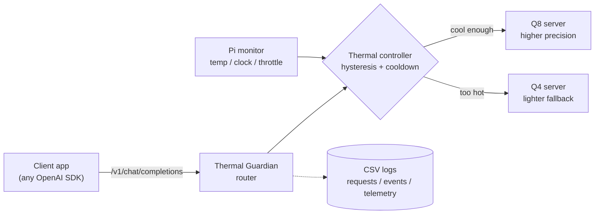

# Thermal Guardian

**A thermal-aware LLM router for the Raspberry Pi 5.** It keeps a locally hosted
chatbot responsive under sustained load by automatically switching between a
higher-precision model (Q8) and a lighter fallback (Q4) based on the device's
temperature — all behind a standard OpenAI-compatible API.

[](LICENSE)


> **Part of the Edge Guardian series** — resource-aware adaptive model switching on the Raspberry Pi 5. Sibling project: [Pose Guardian](https://github.com/ryokotaka/pose-guardian) (real-time pose estimation that sheds load under CPU/resource pressure).

---

## In one minute

A Raspberry Pi 5 is a small, low-power computer about the size of a deck of
cards. It can run a modern AI chat model locally, with no cloud inference
required.

The catch is heat. When a small computer works hard for a long time it warms up,
and once it gets too hot it protects itself by *throttling* — deliberately
slowing down. For a chatbot, that means replies turn sluggish exactly when the
device is busiest.

`Thermal Guardian` sits in front of two versions of the same AI model: a
heavier, higher-precision one (**Q8**) and a lighter, faster fallback (**Q4**).
It continuously reads the chip's temperature and — much like a car shifting to a
lower gear on a steep climb — switches to the lighter model when things heat up,
then shifts back once the device cools. Applications talk to it through the same
API they would use for OpenAI, so it can often be used by changing the base URL
rather than rewriting client code.

This project is as much about **measuring honestly** as about the router itself.
The headline finding is deliberately modest: on this hardware and this workload,
simply always using the light Q4 model was already the strongest baseline. The
controller's measurable value showed up against always using the heavy Q8 model
— **72% faster** and **32% less energy per generated token** — with no
throttling or thermal safety stops in the selected M2 fan-on N=5 runs. Where a
simple choice already wins, the project says so.

## Results at a glance


Five 30-minute runs per mode on a Raspberry Pi 5 with active cooling, same chat
workload, reporting the median of each run:

| Mode | Speed (tok/s) — higher better | Energy (J/token) — lower better | Latency (ms) — lower better | Peak temp (°C) | Throttled | Safety stop |
| --- | ---: | ---: | ---: | ---: | :---: | :---: |
| `q8_fixed` — always the heavy model | 6.53 | 1.081 | 4133 | 65.3 | No | No |
| `q4_fixed` — always the light model | **11.27** | **0.677** | **2661** | 68.1 | No | No |
| `controller` — switches by temperature | 11.23 | 0.731 | 2671 | 68.1 | No | No |

**How to read this honestly:** fixed Q4 was the best baseline in this workload.
The controller nearly matched it on speed (within 0.4%) because it switches to Q4
under sustained load, and it clearly beat fixed Q8 (+72% throughput, −32%
J/token). Across all five controller runs it switched Q8 → Q4 and back, with **no
throttling and no thermal safety stops**. The result is not a claim that the
controller is universally better — it is evidence that the thermal-control path
works on real hardware and a clear measurement of where a simple baseline still
wins. The controller earns its keep as a *measured* fallback for a future
quality-sensitive workload where fixed Q4 is not good enough — not as a faster
path than Q4 today.

## Question -> measurement -> finding -> implication

The router is not the whole result. The project is considered finished only
when a measurement reveals something non-obvious about edge LLM inference and
the README can explain the question, measurement, finding, and implication.

Current evidence-backed finding:

- **Question:** under sustained local LLM load on a Raspberry Pi 5, is a thermal
  controller a better default than simply choosing one fixed quantization level?
- **Measurement:** fixed Q8, fixed Q4, and the thermal controller were each run
  for 30 minutes x N=5 with the same prompt, active cooling, USB power-meter
  readings, telemetry CSVs, and router switch logs.
- **Finding:** for this prompt and fan-on setup, fixed Q4 was the best measured
  baseline. The controller's value was narrower but real: it avoided staying on
  fixed Q8 under sustained load, improved over fixed Q8 by +72% token/s and
  -32% J/token, and recorded Q8 -> Q4 -> Q8 switch events in 5/5 controller
  runs. It did not outperform fixed Q4.
- **Implication:** the next discovery step is not another "the controller
  works" demo. The next useful question is why and when control matters: for
  example, whether Q4-only output quality is unacceptable for some prompts,
  whether energy per token changes non-linearly with temperature, or whether
  memory bandwidth is the actual bottleneck.

## Why this exists

Small edge devices can run local LLMs, but they do not behave like desktop GPUs.
Under sustained load, temperature and power delivery become part of the system
design. This project set out to answer concrete questions:

- Can a Raspberry Pi 5 run two quantized LLM backends and switch between them
  live?
- Can that switch be exposed through an OpenAI-compatible API?
- Can the system record enough evidence to fairly compare fixed Q8, fixed Q4,
  and a thermal controller?
- If always using Q4 is not acceptable for some future quality-sensitive
  workload, is there a *measured* fallback that is better than staying on
  fixed Q8?

Output quality and LLM output safety are explicitly **not** evaluated yet. They
are future work, not claims made by this repository.

## How it works



The controller is a small, deliberately boring two-state policy:

1. Start on **Q8** while the device is cool enough.
2. Switch to **Q4** when temperature rises past an upper threshold.
3. Switch back to **Q8** only after temperature falls below a *lower* threshold.
4. Block rapid back-and-forth switching with a cooldown timer.

Using two thresholds instead of one (*hysteresis*) plus a time-based *cooldown*
prevents the system from flapping between models near a single trip point. Every
decision — including switches that were blocked by cooldown — is written to CSV
so the behavior can be audited after a run. The evaluation used `temp_up = 63 °C`,
`temp_down = 59 °C`, and a 10-second cooldown.

## Evaluation

The headline numbers come from the M2 fan-on protocol:

- **Device:** Raspberry Pi 5 (4 GB), active cooler attached
- **Models:** Qwen2.5-1.5B, `Q8_0` vs `Q4_K_M` GGUF, served by `llama.cpp`
- **Workload:** one fixed chat prompt, `temperature = 0`, `max_tokens = 64`
- **Runs:** 1800 s per run, **N = 5** per condition, reported as medians + IQR
- **Power:** energy per token derived from manual USB power-meter readings

What the experiment **showed**:

- The Pi 5 ran both Q8 and Q4 `llama-server` backends, and the router served
  OpenAI-compatible chat requests against them.
- The controller switched Q8 → Q4 and back in **5 / 5** controller runs.
- All 15 selected runs completed with `throttle_seen = false` and
  `safety_stop = false`.
- Fixed Q4 was the best baseline on latency, throughput, and J/token.
- The controller improved over fixed Q8 (+72% tok/s, −32% J/token) but did not
  outperform fixed Q4.

(What it does *not* show is listed under [Limitations](#limitations).)

Full evidence summary:
[`docs/m2_full_fan_on_n5_results.md`](docs/m2_full_fan_on_n5_results.md).

## Findings: thermal dynamics & look-ahead control

I added a look-ahead variant of the controller (switch on *predicted* temperature,
from the recent slope) to test whether the long thermal time constant makes
anticipatory switching worthwhile. A pilot falsified the naive predictor — it
flapped and switched ~18 °C below the band — so I bounded it (minimum samples, a
cold-region floor, a capped predicted rise, reactive recovery). A cleaner
reboot-pair run then produced a **counterexample**:

> Early switching did not automatically lower thermal exposure. Because the load
> generator is closed-loop ("send the next request immediately"), moving to the
> faster Q4 path increased completed work in the same window — so the thermal
> controller and the benchmark design were coupled. That reframed the question from
> "can I switch earlier?" to "what workload model is fair for evaluating thermal
> control?"

I then re-ran the comparison with a fixed scheduled demand
(`arrival_interval_sec=4.0`, 150 completed requests per run). In an **N=3
open-loop pilot**, bounded look-ahead stayed below 63 C in 3/3 runs, while the
reactive controller exceeded 63 C in 3/3 runs. Median peak temperature was 63.7 C
for reactive vs 62.0 C for bounded look-ahead; median time at or above 63 C was
207.1 s vs 0.0 s.


This is still a pilot, not a tuned result: the bounded controller switched often
(median 18 `switch_to_q4` events per run), and output quality / long-run
stability were not evaluated. Full apparatus, data summaries, and the next
validation step are in [`docs/findings_lookahead.md`](docs/findings_lookahead.md).

## Try it locally (no Raspberry Pi needed)

Local runs use fake backends, so you can explore the router on any machine.

```bash
python -m pip install -e ".[dev]"
python -m pytest
```

Start fake Q8 and Q4 servers, then run the router (add `--dry-run` to skip
backends entirely):

```bash
python scripts/fake_llama_server.py --port 8081 --name q8
python scripts/fake_llama_server.py --port 8082 --name q4
python -m thermal_guardian.router --config config.example.json
```

## Run on a Raspberry Pi

<details>
<summary>Expand for the full Pi workflow (model serving, runs, power summary)</summary>

Local Pi configuration files are intentionally ignored by git. Copy the example
configs and fill in local model paths and ports:

```bash
cp m0.example.json m0.local.json
cp m2.example.json m2.local.json
cp config.m2.fan_on.example.json config.m2.fan_on.local.json
```

Start and check the Q8/Q4 servers:

```bash
python -m thermal_guardian.m0 start --config m0.local.json
python -m thermal_guardian.m0 check --config m0.local.json
python -m thermal_guardian.m0 chat-smoke \
  --config m0.local.json \
  --output data/m0/YYYY-MM-DD/chat_smoke.csv
```

Run an M2 comparison condition:

```bash
python -m thermal_guardian.m2 run \
  --config m2.local.json \
  --mode controller \
  --output-dir data/m2/YYYY-MM-DD/fan_on_full/controller_001 \
  --duration-sec 1800 \
  --cooling fan_on \
  --prompt-id-prefix m2-full
```

Join manual USB power-meter readings with run summaries:

```bash
python -m thermal_guardian.m2 power-summary \
  --manual-power data/m2/YYYY-MM-DD/fan_on_full/manual_power_readings.csv \
  --input data/m2/YYYY-MM-DD/fan_on_full/q8_fixed_001 \
  --input data/m2/YYYY-MM-DD/fan_on_full/q4_fixed_001 \
  --input data/m2/YYYY-MM-DD/fan_on_full/controller_001 \
  --output data/m2/YYYY-MM-DD/fan_on_full/power_summary.csv
```

</details>

## Repository map

```text
src/thermal_guardian/
  monitor.py      Raspberry Pi telemetry (temperature, clock, throttling)
  controller.py   Q8/Q4 thermal state machine (hysteresis + cooldown)
  router.py       OpenAI-compatible forwarding API
  logger.py       CSV request/event logging
  m0.py           real-model bring-up helpers
  m1.py           switch-event load and analysis helpers
  m2.py           fixed-workload comparison helpers

docs/
  m2_full_fan_on_n5_results.md   completed N=5 evidence summary
  m2_full_protocol.md            full evaluation protocol
  evidence_log.md                checked facts and safe wording
  assets/                        figures used in this README
```

## Evidence and reproducibility

Tracked docs summarize the evidence without committing raw experiment outputs:

- [`docs/evidence_log.md`](docs/evidence_log.md) — checked facts and the exact
  wording each one supports
- [`docs/m2_full_protocol.md`](docs/m2_full_protocol.md) — the full evaluation
  protocol
- [`docs/m2_full_fan_on_n5_results.md`](docs/m2_full_fan_on_n5_results.md) — the
  completed N=5 results
- [`DECISIONS.md`](DECISIONS.md) — dated, approved project decisions

Raw CSVs, USB-meter photos, local configs, model paths, and archives stay out of
git under ignored paths such as `data/` and `*.local.json`. The archived N=5
artifact bundle is referenced by SHA-256 in the results doc so a run can be tied
to a specific evidence package.

## Limitations

- The current evaluation uses one simple prompt workload.
- Output quality and LLM output safety were not evaluated.
- Fixed Q4 was the best baseline in the measured workload.
- Controller thresholds were chosen for the fan-on evaluation and are not
  claimed to be optimal.
- Fan-off long-run stability is not claimed; an earlier no-fan run reached a
  thermal safety stop.

## Roadmap / open questions

- **Validate look-ahead (next):** the open-loop N=3 pilot suggests bounded
  look-ahead keeps the CPU below the threshold — but with much more Q4 time, a
  chatty switch policy, and unmatched start temperatures. Confirm with matched
  starts, a calmer policy, and a control for total Q4 time (e.g. versus a
  lower-threshold reactive controller). See
  [`docs/findings_lookahead.md`](docs/findings_lookahead.md).
- Does the controller help when Q4's quality is *not* acceptable for every
  prompt?
- Can a quality-aware policy beat fixed Q4?
- How do longer prompts, higher concurrency, or different models shift the
  Q8 / Q4 / controller trade-off?
- Can thresholds be tuned for lower peak temperature without giving up too much
  Q8 time?
- Does J/token break down non-linearly as temperature rises within a run? This
  requires time-aligned power telemetry, not just run-level USB-meter totals.
- Is the limiting factor thermal headroom, CPU execution, or memory bandwidth?
  This requires `perf`, STREAM-style bandwidth measurement, and a roofline-style
  plot before making architecture claims.

## License

Licensed under the Apache License 2.0 — see [`LICENSE`](LICENSE). Model weights
are not included; third-party models and runtime dependencies are governed by
their own licenses.
