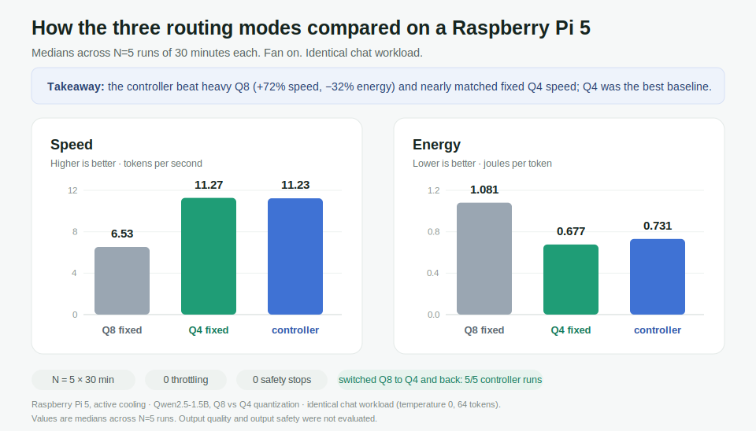
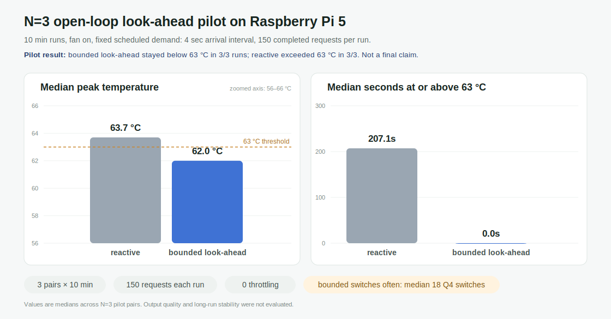
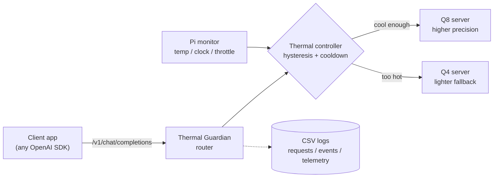

# Thermal Guardian

**A thermal-aware LLM router for the Raspberry Pi 5.** It keeps a locally hosted
chatbot responsive under sustained load by automatically switching between a
higher-precision model (Q8) and a lighter fallback (Q4) based on the device's
temperature — all behind a standard OpenAI-compatible API.

[](LICENSE)


> **Part of the Edge Guardian series** — resource-aware adaptive model switching on the Raspberry Pi 5. Sibling project: [Pose Guardian](https://github.com/ryokotaka/pose-guardian) (real-time pose estimation that sheds load under CPU/resource pressure).

*New here? **In one minute** and **Results at a glance** are the short version.
Methods, data, and reproduction steps follow.*

---

## In one minute

A Raspberry Pi 5 is a small, low-power computer about the size of a deck of
cards. It can run a modern AI chat model locally, with no cloud required.

The catch is heat. When a small computer works hard for a long time it warms up,
and once it gets too hot it protects itself by *throttling* — deliberately
slowing down. For a chatbot, that means replies turn sluggish exactly when the
device is busiest.

`Thermal Guardian` sits in front of two versions of the same AI model: a
heavier, higher-precision one (**Q8**) and a lighter, faster fallback (**Q4**).
It continuously reads the chip's temperature and switches to the lighter model
when things heat up, then shifts back once the device cools, much like a car
dropping to a lower gear on a steep climb. Applications talk to it through the
same API they would use for OpenAI, so adopting it can be as simple as changing
the base URL.

## What's notable

Two findings limit what this controller can claim, and both are reported in
full:

- **The simplest baseline won.** On this hardware and workload, the best baseline
  was simply always running the light Q4 model; the temperature-switching
  controller never beat it. The controller's only measurable gain was over the
  heavy Q8 model: +72% tokens/s (11.23 vs 6.53) and −32% energy per token
  (0.731 vs 1.081 J/token).
- **A look-ahead idea was walked back.** Switching on *predicted* temperature
  looked promising in a pilot, but against a non-predictive controller given the
  same Q4 time, the peak-temperature gap shrank to 0.6 °C (62.0 vs 62.6 °C). The
  gain came from time spent on Q4, not from prediction.

## Results at a glance



Five 30-minute runs per mode on a Raspberry Pi 5 with active cooling, same chat
workload, reporting the median of each run:

| Mode | Speed (tok/s) — higher better | Energy (J/token) — lower better | Latency (ms) — lower better | Peak temp (°C) | Throttled | Safety stop |
| --- | ---: | ---: | ---: | ---: | :---: | :---: |
| `q8_fixed` — always the heavy model | 6.53 | 1.081 | 4133 | 65.3 | No | No |
| `q4_fixed` — always the light model | **11.27** | **0.677** | **2661** | 68.1 | No | No |
| `controller` — switches by temperature | 11.23 | 0.731 | 2671 | 68.1 | No | No |

**What the numbers say:** fixed Q4 was the best baseline in this workload. The
controller nearly matched it on speed (within 0.4%) because under sustained load
it switches to Q4 and stays there: in each 30-minute run it switched to Q4 once
and back once (`switch_to_q4 = 1`, `switch_to_q8 = 1`). It clearly beat fixed Q8
(+72% throughput, −32% J/token) and finished all five runs with no throttling and
no thermal safety stops. The controller is not universally better; it is a working
thermal-control path, and a measurement of where the simple baseline still wins.

## What I asked, measured, and found

The router is not the whole result. This project is considered finished only when
a measurement reveals something non-obvious about edge LLM inference, stated as
the **question, measurement, finding, and implication**. Three such results so
far.

### 1. Is a thermal controller a better default than a fixed model?

- **Measured:** fixed Q8, fixed Q4, and the controller, each run 30 minutes ×
  N=5 with the same prompt, active cooling, USB power-meter readings, full
  telemetry, and router switch logs.
- **Found:** for this prompt and fan-on setup, **fixed Q4 was the best baseline.**
  The controller's value was narrower but real: it avoided being stuck on the slow
  Q8 model under load, beat fixed Q8 by **+72% tokens/s and −32% J/token**, and
  recorded a Q8 → Q4 → Q8 switch in 5/5 runs. It did not beat fixed Q4.
- **Implication:** the controller is worth keeping as a *measured* fallback for a
  future quality-sensitive workload where Q4 is not good enough, not as a faster
  path than Q4 today.

### 2. Does "look-ahead" cut heat by predicting, or just by using Q4 more?

I added a look-ahead controller that switches on *predicted* temperature (from
the recent slope), to test whether the Pi's slow thermal response makes
anticipating worthwhile. An early version flapped, so I bounded it. A cleaner
rerun then produced a **counterexample**:

> Switching earlier did not automatically lower heat. The load generator was
> closed-loop ("send the next request immediately"), so moving to the faster Q4
> path did *more work* in the same window, so the controller and the benchmark
> were coupled. The real question became: *what workload is fair for evaluating
> thermal control?*



- **Measured:** a fair, open-loop load (fixed arrival rate, 150 completed
  requests per run). Bounded look-ahead (N=3) vs a non-predictive reactive
  controller tuned to spend a *similar* amount of time on Q4.
- **Found:** once Q4 time was matched, the thermal edge **largely disappeared**:
  median peak 62.0 vs 62.6 °C, both 0.0 s above 63 °C (look-ahead used a median
  226.7 s on Q4, the matched reactive arm 235.3 s).
- **Implication:** on this workload, the real lever was **how much time is spent
  on the lighter model, not prediction itself.**

### 3. Can a "commit to Q4" rule cut switching for free?

A follow-up tested a minimum-residence (dwell) rule: once on Q4, stay there a
while before switching back, to reduce noisy flapping between models.


- **Found:** more dwell cut switches (36 → 7 across 0–120 s) but also raised Q4
  residence time, and the 30 s setting peaked at 63.1 °C (2.0 s above the
  threshold). It is a **trade-off, not a free win**, and the sweep is noisy
  (mostly single runs) with no clean optimum.
- **Implication:** anti-flap control trades switch economy against Q4 residence
  time here; the next design question is *how much* extra Q4 time is acceptable
  per switch removed, not simply "more dwell."

Full apparatus, data, and write-up of all three:
[`docs/findings_lookahead.md`](docs/findings_lookahead.md).

## Why this exists

Small edge devices can run local LLMs, but they do not behave like desktop GPUs.
Under sustained load, temperature and power delivery become part of the system
design. This project set out to answer concrete questions:

- Can a Raspberry Pi 5 run two quantized LLM backends and switch between them
  live?
- Can that switch be exposed through an OpenAI-compatible API?
- Can the system record enough evidence to fairly compare fixed Q8, fixed Q4,
  and a thermal controller?
- If always using Q4 is not acceptable for some future quality-sensitive
  workload, is there a *measured* fallback that beats staying on fixed Q8?

Output quality and LLM output safety are explicitly **not** evaluated yet. They
are future work, not claims made by this repository.

## How it works



The controller is a small, deliberately boring two-state policy:

1. Start on **Q8** while the device is cool enough.
2. Switch to **Q4** when temperature rises past an upper threshold.
3. Switch back to **Q8** only after temperature falls below a *lower* threshold.
4. Block rapid back-and-forth switching with a cooldown timer.

Using two thresholds instead of one (*hysteresis*) plus a time-based *cooldown*
stops the system from flapping between models near a single trip point. Every
decision — including switches blocked by cooldown — is written to CSV so the
behavior can be audited after a run. The evaluation used `temp_up = 63 °C`,
`temp_down = 59 °C`, and a 10-second cooldown.

## How it was evaluated

The headline numbers come from the M2 fan-on protocol:

- **Device:** Raspberry Pi 5 (4 GB), active cooler attached
- **Models:** Qwen2.5-1.5B, `Q8_0` vs `Q4_K_M` GGUF, served by `llama.cpp`
- **Workload:** one fixed chat prompt, `temperature = 0`, `max_tokens = 64`
- **Runs:** 1800 s per run, **N = 5** per condition, reported as medians + IQR
- **Power:** energy per token derived from manual USB power-meter readings

What the experiment **showed**: the Pi 5 ran both Q8 and Q4 `llama-server`
backends; the router served OpenAI-compatible chat against them; the controller
switched Q8 → Q4 and back in **5/5** runs; all 15 selected runs finished with no
throttling and no safety stops; fixed Q4 was the best baseline on latency,
throughput, and J/token; and the controller beat fixed Q8 (+72% tok/s, −32%
J/token) but did not beat fixed Q4. What it does *not* show is under
[Limitations](#limitations). Full evidence:
[`docs/m2_full_fan_on_n5_results.md`](docs/m2_full_fan_on_n5_results.md).

## Try it locally (no Raspberry Pi needed)

Local runs use fake backends, so you can explore the router on any machine.

```bash
python -m pip install -e ".[dev]"
python -m pytest
```

Start fake Q8 and Q4 servers, then run the router (add `--dry-run` to skip
backends entirely):

```bash
python scripts/fake_llama_server.py --port 8081 --name q8
python scripts/fake_llama_server.py --port 8082 --name q4
python -m thermal_guardian.router --config config.example.json
```

## Run on a Raspberry Pi

<details>
<summary>Expand for the full Pi workflow (model serving, runs, power summary)</summary>

Local Pi configuration files are intentionally ignored by git. Copy the example
configs and fill in local model paths and ports:

```bash
cp m0.example.json m0.local.json
cp m2.example.json m2.local.json
cp config.m2.fan_on.example.json config.m2.fan_on.local.json
```

Start and check the Q8/Q4 servers:

```bash
python -m thermal_guardian.m0 start --config m0.local.json
python -m thermal_guardian.m0 check --config m0.local.json
python -m thermal_guardian.m0 chat-smoke \
  --config m0.local.json \
  --output data/m0/YYYY-MM-DD/chat_smoke.csv
```

Run an M2 comparison condition:

```bash
python -m thermal_guardian.m2 run \
  --config m2.local.json \
  --mode controller \
  --output-dir data/m2/YYYY-MM-DD/fan_on_full/controller_001 \
  --duration-sec 1800 \
  --cooling fan_on \
  --prompt-id-prefix m2-full
```

Join manual USB power-meter readings with run summaries:

```bash
python -m thermal_guardian.m2 power-summary \
  --manual-power data/m2/YYYY-MM-DD/fan_on_full/manual_power_readings.csv \
  --input data/m2/YYYY-MM-DD/fan_on_full/q8_fixed_001 \
  --input data/m2/YYYY-MM-DD/fan_on_full/q4_fixed_001 \
  --input data/m2/YYYY-MM-DD/fan_on_full/controller_001 \
  --output data/m2/YYYY-MM-DD/fan_on_full/power_summary.csv
```

</details>

## Where to read more

The documentation is organized by what you want to check:

- **The evidence behind the headline numbers** →
  [`docs/m2_full_fan_on_n5_results.md`](docs/m2_full_fan_on_n5_results.md)
- **How the evaluation was run (protocol)** →
  [`docs/m2_full_protocol.md`](docs/m2_full_protocol.md)
- **The look-ahead and dwell investigation (lab notebook)** →
  [`docs/findings_lookahead.md`](docs/findings_lookahead.md)
- **Every checked fact and the exact wording it supports** →
  [`docs/evidence_log.md`](docs/evidence_log.md)
- **Dated, approved project decisions** → [`DECISIONS.md`](DECISIONS.md)

Raw CSVs, USB-meter photos, local configs, model paths, and archives stay out of
git under ignored paths such as `data/` and `*.local.json`. The archived N=5
artifact bundle is referenced by SHA-256 in the results doc, so a run can be tied
to a specific evidence package.

## Repository map

```text
src/thermal_guardian/
  monitor.py      Raspberry Pi telemetry (temperature, clock, throttling)
  controller.py   Q8/Q4 thermal state machine (hysteresis + cooldown)
  router.py       OpenAI-compatible forwarding API
  logger.py       CSV request/event logging
  m0.py           real-model bring-up helpers
  m1.py           switch-event load and analysis helpers
  m2.py           fixed-workload comparison helpers
  q4_budget.py    Q4-residence / switch-economy analysis
```

## Limitations

- The current evaluation uses one simple prompt workload.
- Output quality and LLM output safety were not evaluated.
- Fixed Q4 was the best baseline in the measured workload.
- Controller thresholds were chosen for the fan-on evaluation and are not
  claimed to be optimal.
- Fan-off long-run stability is not claimed; an earlier no-fan run reached a
  thermal safety stop.

## Roadmap / open questions

- **Switch economy:** controlling for total Q4 time made look-ahead's thermal
  edge largely vanish. A minimum-residence follow-up then reduced switching, but
  the 60-second N=3 confirmation increased Q4 fraction from 0.378 to 0.562 while
  reducing total switches from 36 to 11. This is useful evidence of a control
  trade-off, not a new performance claim. See
  [`docs/findings_lookahead.md`](docs/findings_lookahead.md).
- Does the controller help when Q4's quality is *not* acceptable for every
  prompt?
- Can a quality-aware policy beat fixed Q4?
- How do longer prompts, higher concurrency, or different models shift the
  Q8 / Q4 / controller trade-off?
- Can thresholds be tuned for lower peak temperature without giving up too much
  Q8 time?
- Does J/token break down non-linearly as temperature rises within a run? This
  requires time-aligned power telemetry, not just run-level USB-meter totals.
- Is the limiting factor thermal headroom, CPU execution, or memory bandwidth?
  This requires `perf`, STREAM-style bandwidth measurement, and a roofline-style
  plot before making architecture claims.

## Plain-language glossary

<details>
<summary>Quantization (Q8 / Q4), throttling, J/token, hysteresis</summary>

- **Quantization, Q8 / Q4:** ways to store an AI model with more or fewer bits
  of precision. **Q8** keeps more detail (heavier, slower, higher quality);
  **Q4** is compressed (lighter, faster, slightly lower quality). Same model,
  two "weights classes."
- **Throttling:** a chip's self-protection. When it gets too hot it deliberately
  slows itself down to avoid damage — which makes a chatbot feel laggy.
- **J/token:** joules of energy spent per generated word-piece. Lower is more
  energy-efficient.
- **Hysteresis:** using a higher threshold to switch *up* and a lower threshold
  to switch *back*, so the system does not rapidly flip back and forth around a
  single point (like a home thermostat).

</details>

## License

Licensed under the Apache License 2.0 — see [`LICENSE`](LICENSE). Model weights
are not included; third-party models and runtime dependencies are governed by
their own licenses.
