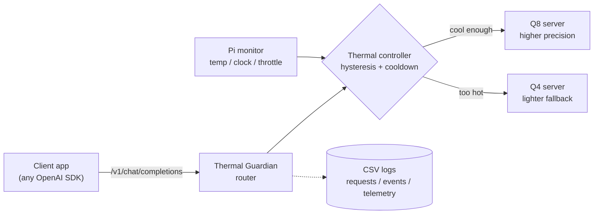

# Thermal Guardian

**A thermal-aware LLM router for the Raspberry Pi 5.** When the chip heats up
under sustained load, it trades model quality for continuity: it steps down from a
higher-precision model (Q8) to a lighter one (Q4) so the service keeps running
instead of throttling or shutting down, then restores Q8 once the device cools —
all behind a standard OpenAI-compatible API.

[](LICENSE)


> **Part of the Edge Guardian series** — resource-aware adaptive model switching on the Raspberry Pi 5. Sibling project: [Pose Guardian](https://github.com/ryokotaka/pose-guardian) (real-time pose estimation that sheds load under CPU/resource pressure).

---

## The payoff, in one picture


Under a deliberate thermal stress (active fan removed), **always running the
high-quality Q8 model overheated and hit the Pi's throttle/shutdown protection,
stopping in all 3 runs after about 100 of 200 requests.** The controller stepped
down to the lighter Q4 model as it heated and **served all 200 requests for the
full 20-minute window in all 3 runs**, with no throttle, the same survival as
always-Q4, while reaching for Q8 quality whenever the chip was cool enough.

That is the whole idea: **graceful degradation.** Give up some model quality to
keep the service alive, instead of letting the hardware throttle everything or shut
down. (Honest scope: this shows service *continuity*, not output quality: Q4's
answers may be worse, and that is not measured here.)

## What it is

A Raspberry Pi 5 can run a modern chat model locally, with no cloud. The catch is
heat: under sustained load the chip warms up, and to protect itself it *throttles*
(bluntly slows everything down) or, past a harder limit, shuts off. Thermal
Guardian sits in front of two versions of the same model — a heavier, higher-quality
**Q8** and a lighter, faster **Q4** — reads the chip's temperature, and switches to
Q4 when things get hot and back to Q8 when they cool. Applications talk to it through
the same API they would use for OpenAI, so adopting it can be as simple as changing
the base URL.

The unfamiliar terms (Q8 / Q4 quantization, throttling, J/token, hysteresis) are
explained in the [glossary](#plain-language-glossary).

## How it works



The controller is a small, deliberately boring two-state policy: start on **Q8**;
switch to **Q4** when temperature rises past an upper threshold; switch back to
**Q8** only after it falls below a *lower* threshold; and block rapid flip-flopping
with a cooldown timer. Two thresholds (*hysteresis*) plus the cooldown stop it from
chattering around a single trip point. Every decision — including switches blocked
by cooldown — is written to CSV so a run can be audited afterward.

## What I measured

A working router is table stakes. The bar I set was to surface at least one finding
that isn't obvious in advance, and to report each result honestly, including where
the controller does *not* help. Each is framed as a question, a measurement, and a
finding.

### 1. Under thermal stress, does the controller keep serving? (the payoff)

- **Measured:** with the fan removed and airflow blocked, three arms — fixed Q8,
  fixed Q4, and the controller — under the same fixed open-loop request rate
  (`arrival_interval_sec = 6`, 1200 s window). A Q4 smoke run first confirmed Q4
  could survive the load. Starts were gated to 55–59 °C (not perfectly identical).
- **Found:** fixed Q8 hit the Pi soft-temperature throttle bit (`0x80000`) and
  stopped in **3/3** runs (median ~100 of 200 requests, peak ~81 °C). The controller
  and fixed Q4 each completed all **200/200** requests for the full 1200 s in 3/3
  runs with no throttle (controller median peak 77.9 °C, ~78% of the time on Q4).
- **Implication:** the first replicated case where graceful degradation paid off:
  *service continuity* where always-Q8 could not. It still overshot its 71.1 °C
  target (reactive lag), so tighter thermal margin is the open engineering question.
  See [`docs/m3_thermal_stress_protocol.md`](docs/m3_thermal_stress_protocol.md).

### 2. With the fan on, is the controller even needed? (the honest baseline)


Five 30-minute runs per mode with active cooling, same workload, median of each run:

| Mode | Speed (tok/s) — higher better | Energy (J/token) — lower better | Latency (ms) — lower better | Peak temp (°C) | Throttled | Safety stop |
| --- | ---: | ---: | ---: | ---: | :---: | :---: |
| `q8_fixed` — always the heavy model | 6.53 | 1.081 | 4133 | 65.3 | No | No |
| `q4_fixed` — always the light model | **11.27** | **0.677** | **2661** | 68.1 | No | No |
| `controller` — switches by temperature | 11.23 | 0.731 | 2671 | 68.1 | No | No |

- **Found:** with the fan on, nothing throttled — not even fixed Q8 — so the
  fallback was never required. Fixed Q4 was the best baseline; the controller
  matched it within 0.4% on speed (it switches to Q4 and stays) and beat fixed Q8
  (**+72% tokens/s, −32% J/token**), but did not beat Q4.
- **Implication:** the controller is not a faster path than Q4 on an easy workload.
  Its value is as a *measured fallback* for the cases the fan-on runs could not
  create: a quality-sensitive workload where Q4 is not good enough, or thermal
  stress that would throttle fixed Q8 (result 1). Full evidence:
  [`docs/m2_full_fan_on_n5_results.md`](docs/m2_full_fan_on_n5_results.md).

### 3. Does predicting the heat (look-ahead) beat just using Q4 more?

I also tested a *predictive* controller that switches on the temperature forecast
from the recent slope, and a *dwell* rule that commits to Q4 to reduce flapping.
Both produced a useful negative result. Once the load was made fair (open-loop) and
the comparison controlled for time spent on Q4, look-ahead's thermal edge **largely
disappeared** (median peak 62.0 vs 62.6 °C): the lever was *time on the lighter
model, not prediction.* The dwell rule cut model switches (36 → 7) only by spending
more time on Q4, a trade-off rather than a free win. Full lab notebook, with figures:
[`docs/findings_lookahead.md`](docs/findings_lookahead.md).

## How it was evaluated

The fan-on baseline came from the M2 protocol:

- **Device:** Raspberry Pi 5 (4 GB), active cooler attached (fan-off for the stress test in result 1)
- **Models:** Qwen2.5-1.5B, `Q8_0` vs `Q4_K_M` GGUF, served by `llama.cpp`
- **Workload:** one fixed chat prompt, `temperature = 0`, `max_tokens = 64`
- **Runs:** 1800 s per run, **N = 5** per condition, medians + IQR
- **Power:** energy per token from manual USB power-meter readings (run-level)

Across all 15 selected fan-on runs the controller switched Q8 → Q4 and back, and
none throttled or hit a safety stop. What the project does *not* claim is under
[Limitations](#limitations).

## Try it locally (no Raspberry Pi needed)

Local runs use fake backends, so you can explore the router on any machine.

```bash
python -m pip install -e ".[dev]"
python -m pytest

# fake Q8 + Q4 servers, then the router (add --dry-run to skip backends)
python scripts/fake_llama_server.py --port 8081 --name q8
python scripts/fake_llama_server.py --port 8082 --name q4
python -m thermal_guardian.router --config config.example.json
```

## Run on a Raspberry Pi

<details>
<summary>Expand for the full Pi workflow (model serving, runs, power summary)</summary>

Local Pi configuration files are intentionally ignored by git. Copy the example
configs and fill in local model paths and ports:

```bash
cp m0.example.json m0.local.json
cp m2.example.json m2.local.json
cp config.m2.fan_on.example.json config.m2.fan_on.local.json
```

Start and check the Q8/Q4 servers:

```bash
python -m thermal_guardian.m0 start --config m0.local.json
python -m thermal_guardian.m0 check --config m0.local.json
python -m thermal_guardian.m0 chat-smoke \
  --config m0.local.json \
  --output data/m0/YYYY-MM-DD/chat_smoke.csv
```

Run an M2 comparison condition and join USB power readings:

```bash
python -m thermal_guardian.m2 run \
  --config m2.local.json --mode controller \
  --output-dir data/m2/YYYY-MM-DD/fan_on_full/controller_001 \
  --duration-sec 1800 --cooling fan_on --prompt-id-prefix m2-full

python -m thermal_guardian.m2 power-summary \
  --manual-power data/m2/YYYY-MM-DD/fan_on_full/manual_power_readings.csv \
  --input data/m2/YYYY-MM-DD/fan_on_full/q8_fixed_001 \
  --input data/m2/YYYY-MM-DD/fan_on_full/q4_fixed_001 \
  --input data/m2/YYYY-MM-DD/fan_on_full/controller_001 \
  --output data/m2/YYYY-MM-DD/fan_on_full/power_summary.csv
```

</details>

## Where to read more

- **Fan-off thermal-continuity result and protocol** →
  [`docs/m3_thermal_stress_protocol.md`](docs/m3_thermal_stress_protocol.md)
- **Fan-on N=5 evidence behind the table** →
  [`docs/m2_full_fan_on_n5_results.md`](docs/m2_full_fan_on_n5_results.md)
- **The look-ahead and dwell investigation (lab notebook, with figures)** →
  [`docs/findings_lookahead.md`](docs/findings_lookahead.md)
- **Full evaluation protocol** →
  [`docs/m2_full_protocol.md`](docs/m2_full_protocol.md)
- **Every checked fact and the exact wording it supports** →
  [`docs/evidence_log.md`](docs/evidence_log.md)
- **Dated, approved project decisions** → [`DECISIONS.md`](DECISIONS.md)

Raw CSVs, USB-meter photos, local configs, and archives stay out of git under
ignored paths such as `data/` and `*.local.json`; evidence bundles are referenced by
SHA-256 so a run can be tied to a specific package.

```text
src/thermal_guardian/
  monitor.py      Raspberry Pi telemetry (temperature, clock, throttling)
  controller.py   Q8/Q4 thermal state machine (hysteresis + cooldown)
  router.py       OpenAI-compatible forwarding API
  m0.py / m1.py / m2.py   bring-up, switch-event, and fixed-workload helpers
  q4_budget.py    Q4-residence / switch-economy analysis
```

## Limitations

- Output quality and LLM output safety were **not** evaluated; the results are about
  thermal behavior and service continuity only.
- With the fan on, fixed Q4 was the best baseline; the controller did not beat it.
- The fan-off continuity result is N=3 on one workload and cooling setup, not
  long-run stability, not a claim of optimal thresholds.
- One simple prompt workload; thresholds were chosen for the fan-on evaluation.

## Roadmap / open questions

- **Thermal margin:** can earlier switching (look-ahead), a lower ceiling, or a
  shorter cooldown keep the fan-off controller nearer its target while preserving
  continuity? Switch *count* is cheap here: requests are independent and both models
  stay resident, so returning to Q8 when cool is quality-seeking, not waste.
- **Quality-sensitive workloads:** does the fallback help when Q4's output quality is
  *not* acceptable for every prompt, and can a quality-aware policy beat fixed Q4?
- **Energy:** does J/token break down non-linearly as temperature rises within a run?
  This needs time-aligned power telemetry (PMIC), not just run-level USB totals.
- **Bottleneck:** is the limit thermal headroom, CPU execution, or memory bandwidth?
  Needs `perf` / STREAM-style measurement before any architecture claim.

## Plain-language glossary

<details>
<summary>Quantization (Q8 / Q4), throttling, J/token, hysteresis</summary>

- **Quantization, Q8 / Q4:** ways to store an AI model with more or fewer bits of
  precision. **Q8** keeps more detail (heavier, slower, higher quality); **Q4** is
  compressed (lighter, faster, slightly lower quality). Same model, two "weight
  classes."
- **Throttling:** a chip's self-protection: when it gets too hot it deliberately
  slows down (and past a harder limit can shut off) to avoid damage.
- **J/token:** joules of energy spent per generated word-piece. Lower is more
  energy-efficient.
- **Hysteresis:** using a higher threshold to switch *up* and a lower one to switch
  *back*, so the system does not flip rapidly around a single point (like a
  thermostat).

</details>

## License

Licensed under the Apache License 2.0 — see [`LICENSE`](LICENSE). Model weights are
not included; third-party models and runtime dependencies are governed by their own
licenses.
