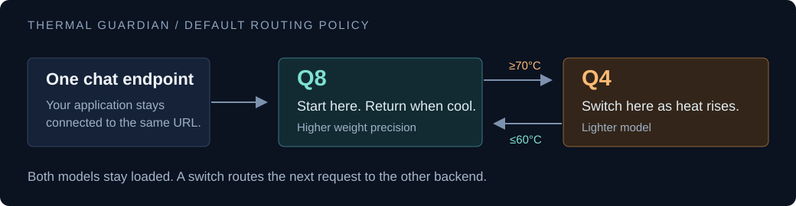
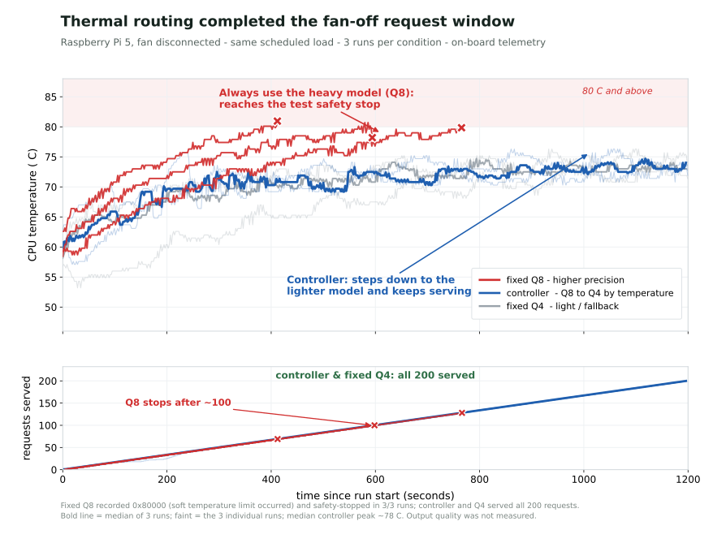

# Thermal Guardian

**Switch between Q8 and Q4 without changing your chat endpoint.**

[Try locally](#try-it-locally) · [Pi setup](#run-on-a-raspberry-pi) · [Experiment](docs/m3_thermal_stress_protocol.md) · [Apache 2.0](LICENSE)

Thermal Guardian routes a Raspberry Pi 5's local LLM requests between Q8 and the lighter Q4 model, using CPU temperature to choose the next backend.



**200/200 requests completed in all three fan-off runs.** Fixed Q8 reached the test's safety stop in all three, after a median of 100 requests. Fixed Q4 also completed all 200. The controller returned to Q8 during cooler periods.

## What switching changes

The router starts on Q8, moves to the lighter Q4 model when temperature rises,
and returns to Q8 when the Pi cools. Both models stay loaded, so a switch changes
the destination of the next request without restarting either backend.

I built this to explore model switching under sustained heat. The comparison
uses Qwen2.5-1.5B-Instruct in two weight quantizations, `Q8_0` and `Q4_K_M`, served
by `llama.cpp` on a Raspberry Pi 5 with 4 GB of RAM.

The fan-off test sent one request every six seconds for 20 minutes, with the
heatsink attached and airflow blocked. Each mode ran three times:

| Mode | Completed requests, median | Peak CPU temperature, median | Runs reaching the safety stop |
| --- | ---: | ---: | ---: |
| Fixed Q8 | 100 / 200 | 81.2 °C | 3 / 3 |
| Controller | 200 / 200 | 77.9 °C | 0 / 3 |
| Fixed Q4 | 200 / 200 | 79.0 °C | 0 / 3 |

The controller matched fixed Q4's completion rate while returning to Q8 during
cooler periods. It spent about 78% of the time on Q4. These results measure
service continuity; answer quality is a separate comparison still to make.

<details>
<summary>View the temperature and completion plots</summary>



</details>

[Experiment conditions and results](docs/m3_thermal_stress_protocol.md)

## Try it locally

You can try the endpoint and routing logs without a Pi or model downloads.
Requires Python 3.11 or newer.

```bash
git clone https://github.com/ryokotaka/thermal-guardian.git
cd thermal-guardian
python3.11 -m venv .venv
source .venv/bin/activate
python -m pip install -e ".[dev]"
python -m thermal_guardian.router --dry-run --fake-monitor
```

In another terminal:

```bash
curl http://127.0.0.1:8080/v1/chat/completions \
  -H 'Content-Type: application/json' \
  -H 'X-Edge-Prompt-Id: demo-001' \
  -d '{"model":"thermal-guardian","messages":[{"role":"user","content":"Say hello."}],"stream":false}'
```

The response says `dry-run routed to q8`. This demo uses a simulated 40 °C reading
and a generated response. Inspect `logs/requests.csv` for requests and
`logs/events.csv` for the controller's temperature samples and decisions.

<details>
<summary>Try HTTP forwarding with two fake model servers</summary>

Stop the dry-run router, then run each command in its own terminal with the
virtual environment activated:

```bash
python scripts/fake_llama_server.py --port 8081 --name q8
python scripts/fake_llama_server.py --port 8082 --name q4
python -m thermal_guardian.router --config config.example.json --fake-monitor
```

Repeat the same `curl` request. The response now comes from the fake Q8 backend.

</details>

## Run on a Raspberry Pi

Install the package as above. You also need `vcgencmd`, a working `llama-server`
build, and the Q8/Q4 GGUF model files. The measured setup used Raspberry Pi OS
Bookworm 64-bit.

```bash
cp m0.example.json m0.local.json
cp config.example.json config.local.json
```

Set the executable and model paths in `m0.local.json`. Match its ports to `q8_url`
and `q4_url` in `config.local.json`, then start both backends and the router:

```bash
python -m thermal_guardian.m0 start --config m0.local.json
python -m thermal_guardian.m0 check --config m0.local.json
python -m thermal_guardian.router --config config.local.json
```

Use the same chat request from the demo. On the Pi, omit `--fake-monitor` to read
real device telemetry. Missing or malformed readings produce HTTP 503; requests
resume when telemetry recovers.

The default policy switches to Q4 at 70 °C and back to Q8 at 60 °C or below, with at
least ten seconds between switches. These settings are configurable. The
experiments used their own settings, recorded in the
[M2](docs/m2_full_protocol.md) and [M3](docs/m3_thermal_stress_protocol.md) protocols.
The [M0 checklist](docs/m0_checklist.md) covers model setup.

## Other experiments

With active cooling, all five 30-minute runs per mode completed. Fixed Q4 gave
the best median speed and energy per token: **11.27 tok/s, 0.677 J/token**, compared
with the controller's **11.23 tok/s, 0.731 J/token**.
[Fan-on comparison](docs/m2_full_fan_on_n5_results.md)

Predicting temperature from its recent slope made little difference once time
spent on Q4 was matched: median peak temperatures differed by **0.6 °C**.
The useful next question is when to spend time on each model.
[Look-ahead experiments](docs/findings_lookahead.md)

<details>
<summary>Measurement details and remaining evaluation work</summary>

- Fixed Q8's `get_throttled=0x80000` is the
  [historical soft-temperature-limit flag](https://www.raspberrypi.com/documentation/computers/os.html#get_throttled).
  The experiment runner stopped the load; a device shutdown was not observed.
- Fan-off starts ranged from 55.4–58.7 °C. Two runs affected by suspected external
  airflow were excluded and repeated, as recorded in the M3 protocol.
- The controller's median peak of 77.9 °C exceeded its 71.1 °C switch point.
  Switching is reactive, and the switch point is not a temperature cap. The
  experiment runner separately enforces an 82 °C safety limit.
- Fan-on energy figures use manual USB-meter readings. Those runs sent each
  request after the preceding response, so faster modes completed more work.
- All results use one device and one prompt workload. Answer-quality comparisons
  and broader workloads remain to be tested.
- Raw CSVs, meter photos, and local configs are not included. The
  [evidence notes](docs/evidence_log.md) link recorded summaries and hashes of
  local archives; recomputing every aggregate requires those archives.

</details>

## Implementation

The API supports `POST /v1/chat/completions` with buffered, non-streaming
responses. The server binds to localhost. Streaming, other OpenAI endpoints,
authentication, and automatic retries to the other model are not implemented.

Start with [`router.py`](src/thermal_guardian/router.py) for request forwarding,
[`controller.py`](src/thermal_guardian/controller.py) for the switching policy,
and [`monitor.py`](src/thermal_guardian/monitor.py) for Pi telemetry.

Run the tests with `python -m pytest`. GitHub Actions runs the same suite on
Python 3.11.

[Pose Guardian](https://github.com/ryokotaka/pose-guardian) applies model switching
to live pose estimation on the Pi.

## License

[Apache 2.0](LICENSE). Third-party models and runtimes have their own licenses.
