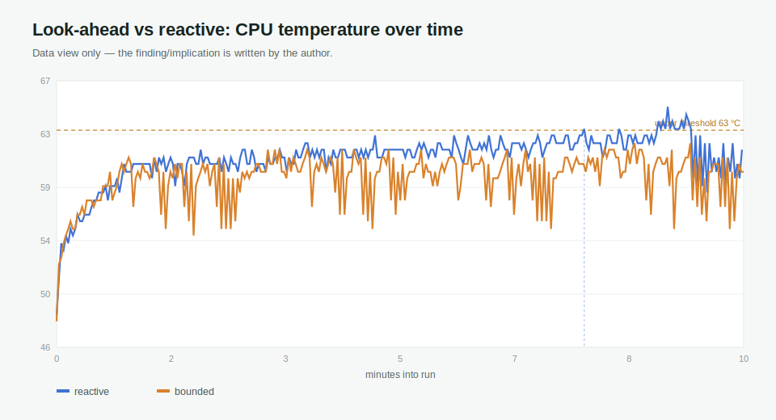

# Findings: thermal dynamics & look-ahead control

> **Working doc.** This is the "question → measurement → finding → implication"
> scaffold for the look-ahead investigation. The assistant fills *question* and
> *measurement* (apparatus, protocol, plots, derived numbers). The **finding and
> implication are written by the author** from the run data — the assistant does
> not write them. Once the finding is backed by reproducible data, lift it into a
> `## Findings` section of the README.

**Status (2026-06-19):** open-loop N=3 pilot complete — bounded look-ahead stayed
below 63 °C in 3/3 runs vs 0/3 for reactive (pilot, not a final claim). The
synthesized conclusion is in **Finding** / **Implication** at the end of this doc;
the sections in between are the chronological run log.

## Question

Heat has a long time constant — unlike an injected-load fault, which is close to a
step. The current controller is **reactive**: it switches Q8 → Q4 only after the
CPU *actually* reaches the upper threshold. If the thermal response is slow and
smooth, a **look-ahead** controller — switching when the temperature *predicted*
`look_ahead_sec` into the future (from the recent slope) crosses the threshold —
could act earlier and change the threshold-crossing behavior.

Does look-ahead control measurably change, versus reactive control:

- the **overshoot** above the threshold (`peak − temp_up`),
- the **time spent above** the threshold,
- the **latency transient** around the switch (from `requests.csv`),

and is any change worth the earlier loss of Q8 time? Either answer is a finding —
"look-ahead does **not** help here, because …" is as valid as "it does."

## Measurement

**Apparatus** (implemented; no new hardware):

- `look_ahead_sec` in the controller config turns on prediction (least-squares
  slope over the last `slope_window` samples × the horizon). `0.0` = today's
  reactive routing behavior. See `src/thermal_guardian/controller.py` and its
  unit tests.
- The predictive path is intentionally bounded after the first pilot:
  - `look_ahead_min_samples` requires enough recent samples before prediction is
    trusted.
  - `look_ahead_min_temp_c` ignores prediction while the CPU is still far below
    the switching band.
  - `look_ahead_max_delta_c` caps how much prediction can add to the current
    temperature.
  - Q4 → Q8 recovery remains reactive on the actual temperature, so a positive
    slope cannot force premature recovery.
- Reactive config: `config.m2.fan_on.example.json` (no `look_ahead_sec` → 0).
- Look-ahead config: `config.m2.fan_on.predictive.example.json`
  (`look_ahead_sec: 30.0` with bounded prediction — a **starting** horizon to
  sweep/tune, not a tuned value).

**Protocol** (fan on, same workload and duration as the M2 evaluation; repeat
**N ≥ 3** per arm). Run the M2 `controller` workload twice with everything
identical except the router's thermal config — once on the reactive config, once
on the predictive config (exact `m2 run` invocation: see
[Run on a Raspberry Pi](../README.md#run-on-a-raspberry-pi)). Suggested layout:

```text
data/m2/DATE/lookahead/reactive_00{1,2,3}/     # router on config.m2.fan_on.local.json
data/m2/DATE/lookahead/predictive_00{1,2,3}/   # router on config.m2.fan_on.predictive.local.json
```

Optional, to quantify τ cleanly: one open-loop heating run from cold under fixed
Q8 load to the plateau (no switching), so the slope/τ estimate is not truncated
by the switch.

**Analysis** (assistant's lane — derives numbers and draws the plot; no claims):

```bash
python scripts/analyze_lookahead.py --temp-up 63 \
  --run reactive=data/m2/DATE/lookahead/reactive_001/telemetry.csv \
  --run predictive=data/m2/DATE/lookahead/predictive_001/telemetry.csv \
  --out-json data/m2/DATE/lookahead/summary.json \
  --out-svg docs/assets/m2_lookahead_compare.svg
```

Per run it reports `tau_63_sec`, `time_to_up_sec`, `peak_temp_c`, `overshoot_c`,
`secs_above_up`, and draws the temperature overlay with per-run threshold-crossing
markers.

Context to record after each analysis run (**data only, not a finding**):
`tau_63_sec`, `time_to_up_sec`, `overshoot_c`, and `secs_above_up`. Do not turn
these into a README claim until the reactive and look-ahead runs for this
investigation have both been collected.

## Pilot calibration note (2026-06-18)

This is a calibration note, not a public README finding. A 10-minute pilot was
run to test the first, naive look-ahead controller before scaling to N >= 3.

Data location on the Pi:

```text
data/m2/2026-06-18/lookahead/reactive_001/
data/m2/2026-06-18/lookahead/predictive_001/
data/m2/2026-06-18/lookahead/lookahead_pilot_summary.json
data/m2/2026-06-18/lookahead/lookahead_pilot.svg
```

Observed data:

| Run | Requests | Switch events | First Q4 switch | Peak temp | Overshoot above 63 C | Seconds above 63 C | Throttle |
| --- | ---: | --- | --- | ---: | ---: | ---: | --- |
| `reactive_001` | 162 | `switch_to_q4=1` | 63.1 C | 65.3 C | 2.3 C | 125.5 s | `0x0` |
| `predictive_001` naive | 190 | `switch_to_q4=9`, `switch_to_q8=8`, `cooldown_blocked=5` | 45.0 C | 64.8 C | 1.8 C | 277.2 s | `0x0` |

What this honestly says:

- The naive slope-only look-ahead controller was too sensitive to early thermal
  slope and sensor noise.
- It switched to Q4 far below the intended thermal band and produced repeated
  Q8/Q4 oscillation.
- Because that behavior was visible in one pilot, the N >= 3 comparison should
  not be run with the naive controller.
- The controller was revised to bounded, upward-only look-ahead before the next
  experiment.

Interview-safe phrasing:

> A pilot falsified the naive predictive controller before I scaled the
> experiment. Instead of hiding the negative result, I changed the controller to
> require enough samples, ignore cold-region slope spikes, cap predicted
> temperature rise, and keep Q4-to-Q8 recovery reactive.

## Bounded look-ahead smoke note (2026-06-18)

After the naive pilot, the controller was changed to bounded upward look-ahead:

```text
look_ahead_sec = 30
slope_window = 10
look_ahead_min_samples = 10
look_ahead_min_temp_c = 59
look_ahead_max_delta_c = 3
```

One 10-minute smoke run was collected to check whether the obvious failure mode
was removed before any longer comparison:

```text
data/m2/2026-06-18/lookahead/predictive_bounded_001/
data/m2/2026-06-18/lookahead/lookahead_bounded_summary.json
data/m2/2026-06-18/lookahead/lookahead_bounded.svg
```

Observed data:

| Run | Requests | Switch events | First Q4 switch | Peak temp | Overshoot above 63 C | Seconds above 63 C | Throttle |
| --- | ---: | --- | --- | ---: | ---: | ---: | --- |
| `predictive_bounded_001` | 214 | `switch_to_q4=1` | 60.4 C | 65.9 C | 2.9 C | 476.8 s | `0x0` |

What this honestly says:

- The bounded controller removed the worst naive failure mode: it no longer
  switched at 45 C and did not flap repeatedly in this 10-minute smoke run.
- This smoke run does **not** show that bounded look-ahead is better than the
  reactive controller on overshoot or time-above-threshold.
- The start temperatures differed between runs, so these 10-minute pilots are
  calibration evidence, not a final comparison.
- If this line of work continues, the next experiment should compare reactive
  versus bounded look-ahead with matched start temperature and N >= 3, or use a
  controlled heating/cooling protocol focused only on switch timing.

## Reboot-pair counterexample (2026-06-18)

After a Raspberry Pi reboot, a cleaner cold-ish pair was run with the same
10-minute duration and no manual power-meter step:

```text
data/m2/2026-06-18/lookahead/reboot_pair_002/reactive/
data/m2/2026-06-18/lookahead/reboot_pair_002/bounded/
data/m2/2026-06-18/lookahead/reboot_pair_002/reboot_pair_summary.json
data/m2/2026-06-18/lookahead/reboot_pair_002/reboot_pair.svg
```

Observed data:

| Run | Start temp | Requests | Switch events | First Q4 switch | Peak temp | Overshoot above 63 C | Seconds above 63 C | Throttle |
| --- | ---: | ---: | --- | --- | ---: | ---: | ---: | --- |
| `reactive` | 42.2 C | 147 | none | none | 63.1 C | 0.1 C | 0.0 s | `0x0` |
| `bounded` | 43.9 C | 215 | `switch_to_q4=1` | 60.4 C | 65.3 C | 2.3 C | 350.1 s | `0x0` |

What this honestly says:

- In this pair, bounded look-ahead switched earlier, but that did **not** reduce
  peak temperature or time above the threshold.
- The bounded run completed many more requests because Q4 is faster in this
  workload. With a closed-loop "send the next request immediately" benchmark,
  switching to the faster backend can increase completed work during the same
  wall-clock window, which can obscure or reverse the expected thermal benefit.
- This is a useful counterexample, not a failure to hide: the control objective
  and the benchmark objective are coupled.

Interview-safe phrasing:

> I found a counterexample in my own follow-up experiment: early switching did
> not automatically lower thermal exposure. Because my load generator was
> closed-loop, moving to the faster Q4 path increased completed work, so the
> thermal controller and benchmark design were coupled. That changed the next
> question from "can I switch earlier?" to "what workload model is fair for
> evaluating thermal control?"

Next step if continuing this line:

- For thermal-control evaluation, use an open-loop fixed arrival rate or fixed
  request count, so Q4 does not automatically create more work per minute.
- Keep the existing closed-loop results as throughput/energy evidence, but do
  not use them alone to claim reduced thermal exposure from look-ahead control.

---

_Apparatus update (assistant): the two open-loop modes this implication calls for
are now in the harness — `--arrival-interval-sec` (fixed arrival rate, schedule-based
dispatch) and the existing `--request-count` (equal total work). `analyze_lookahead.py`
now also reports `completed_requests` per run, so the closed-loop coupling shows up in
the numbers. Reactive vs look-ahead can be re-run fairly; the finding/claim stay yours._

## Open-loop harness smoke note (2026-06-19)

After the Pi reboot, a short smoke test checked that `--arrival-interval-sec`
works on the real device. This is apparatus validation, not a thermal-control
finding.

```text
data/m2/2026-06-19/lookahead_open_loop_smoke_001/reactive/
data/m2/2026-06-19/lookahead_open_loop_smoke_001/bounded/
data/m2/2026-06-19/lookahead_open_loop_smoke_001/open_loop_smoke_summary.json
data/m2/2026-06-19/lookahead_open_loop_smoke_001/open_loop_smoke.svg
```

Run settings:

```text
duration_sec = 300
arrival_interval_sec = 5.0
mode = controller
cooling = fan_on
```

Observed data:

| Run | Start temp | Completed requests | Tokens out | Switch events | Peak temp | Seconds above 63 C | Throttle |
| --- | ---: | ---: | ---: | --- | ---: | ---: | --- |
| `reactive` | 47.2 C | 60 | 1620 | none | 60.9 C | 0.0 s | `0x0` |
| `bounded` | 45.0 C | 60 | 1623 | `switch_to_q4=1`, `switch_to_q8=1`, `cooldown_blocked=3` | 60.9 C | 0.0 s | `0x0` |

What this honestly says:

- The open-loop harness did what it was supposed to do: both runs completed the
  same number of scheduled requests in the same wall-clock window.
- This removes the closed-loop confound where the faster Q4 backend silently
  creates more completed work per minute.
- The 5-minute smoke did not reach 63 C, so it does **not** compare thermal
  control effectiveness. A real comparison needs a longer duration, a shorter
  arrival interval, or a fixed request-count protocol that reaches the switching
  band.


## Open-loop 4-second N=1 pilot note (2026-06-19)

A stronger open-loop pilot used a 4-second scheduled arrival interval for 10
minutes. This is the first run in this branch that both holds completed work
equal and reaches the reactive switching band. It is still **N=1**, so it is a
candidate finding, not a final claim.

```text
data/m2/2026-06-19/lookahead_open_loop_10min_4s_001/reactive/
data/m2/2026-06-19/lookahead_open_loop_10min_4s_001/bounded/
data/m2/2026-06-19/lookahead_open_loop_10min_4s_001/open_loop_4s_summary.json
docs/assets/lookahead_open_loop_4s_pilot.svg
```

Run settings:

```text
duration_sec = 600
arrival_interval_sec = 4.0
mode = controller
cooling = fan_on
bounded look-ahead = 30 sec horizon, min_temp_c=59, max_delta_c=3
```

Observed data:

| Run | Start temp | Completed requests | Tokens out | First switch | Peak temp | Time to 63 C | Seconds above 63 C | Throttle |
| --- | ---: | ---: | ---: | --- | ---: | ---: | ---: | --- |
| `reactive` | 48.8 C | 150 | 4119 | `switch_to_q4` at 63.1 C | 64.8 C | 460.9 s | 93.2 s | `0x0` |
| `bounded` | 48.3 C | 150 | 4230 | `switch_to_q4` at 60.4 C | 62.0 C | not reached | 0.0 s | `0x0` |



What this honestly says:

- Under this open-loop demand, both runs completed the same number of requests.
- The bounded look-ahead controller switched before the reactive threshold and,
  in this N=1 pilot, kept the CPU below 63 C while the reactive controller spent
  93.2 seconds at or above 63 C.
- This is promising enough to repeat, but not enough to claim a general effect.
  The next validation step is N>=3 with the same 4-second open-loop protocol and
  similar starting temperatures.

## Open-loop 4-second N=3 pilot follow-up (2026-06-19)

The N=1 pilot was repeated twice more under the same scheduled-demand protocol.
This gives an N=3 pilot, not a final long-run claim.

```text
data/m2/2026-06-19/lookahead_open_loop_10min_4s_001/
data/m2/2026-06-19/lookahead_open_loop_10min_4s_002/
data/m2/2026-06-19/lookahead_open_loop_10min_4s_003/
data/m2/2026-06-19/lookahead_open_loop_10min_4s_n3/n3_summary.json
docs/assets/lookahead_open_loop_4s_n3_summary.svg
```

Run settings:

```text
duration_sec = 600
arrival_interval_sec = 4.0
completed_requests = 150 per run
mode = controller
cooling = fan_on
bounded look-ahead = 30 sec horizon, min_temp_c=59, max_delta_c=3
```

Observed data:

| Pair | Mode | Start temp | Completed requests | Tokens out | First switch | Peak temp | Seconds above 63 C | Switches to Q4 | Throttle |
| ---: | --- | ---: | ---: | ---: | --- | ---: | ---: | ---: | --- |
| 1 | `reactive` | 48.8 C | 150 | 4119 | 63.1 C | 64.8 C | 93.2 s | 1 | `0x0` |
| 1 | `bounded` | 48.3 C | 150 | 4230 | 60.4 C | 62.0 C | 0.0 s | 19 | `0x0` |
| 2 | `reactive` | 48.3 C | 150 | 4107 | 63.1 C | 63.7 C | 265.7 s | 3 | `0x0` |
| 2 | `bounded` | 45.0 C | 150 | 4218 | 60.4 C | 62.0 C | 0.0 s | 18 | `0x0` |
| 3 | `reactive` | 47.2 C | 150 | 4137 | 63.1 C | 63.7 C | 207.1 s | 4 | `0x0` |
| 3 | `bounded` | 47.2 C | 150 | 4152 | 61.5 C | 62.6 C | 0.0 s | 11 | `0x0` |

Median summary:

| Mode | N | Completed requests | Median peak temp | Median seconds above 63 C | Median Q4 switches | Throttle |
| --- | ---: | ---: | ---: | ---: | ---: | --- |
| `reactive` | 3 | 150 | 63.7 C | 207.1 s | 3 | `0x0` |
| `bounded` | 3 | 150 | 62.0 C | 0.0 s | 18 | `0x0` |


What this honestly says:

- With the same completed request count, the bounded look-ahead controller stayed
  below 63 C in 3/3 runs; the reactive controller exceeded 63 C in 3/3 runs.
- This is now a stronger candidate finding than the N=1 result, because the
  direction repeated across three pilot pairs.
- It is not a final claim yet. One bounded run started cooler than its paired
  reactive run, and the bounded controller switched often. The next engineering
  question is whether the same effect survives cleaner start-temperature matching
  and a less chatty controller policy.

## Finding

This investigation produced two results, in order.

**1 — A methodology counterexample.** Early switching did not automatically lower
thermal exposure. Because the load generator was closed-loop ("send the next
request immediately"), moving to the faster Q4 path increased completed work in the
same window — so the thermal controller and the benchmark design were coupled. The
question changed from "can I switch earlier?" to "what workload model is fair for
evaluating thermal control?"

**2 — Under a fair (open-loop) load, look-ahead looks promising.** With completed
work held equal (`arrival_interval_sec=4.0`, 150 requests per run), an N=3 pilot
showed bounded look-ahead stayed below 63 °C in 3/3 runs while the reactive
controller exceeded it in 3/3 (median peak 62.0 vs 63.7 °C; median time ≥63 °C
0.0 vs 207.1 s). This is a pilot, not a final claim: the bounded controller
switched often (median 18×), start temperatures were not matched, and output
quality / long-run stability were not evaluated.

## Implication

- Evaluate thermal control under an open-loop load (fixed arrival rate or request
  count). The earlier closed-loop runs remain valid only as throughput / energy
  evidence, not as evidence of reduced thermal exposure.
- The look-ahead benefit is not yet isolated from simply spending more time on the
  cooler Q4 model. The next test should control for total Q4 time (e.g. against a
  lower-threshold reactive controller), match start temperatures, and calm the
  switch policy before this becomes a firm claim.
