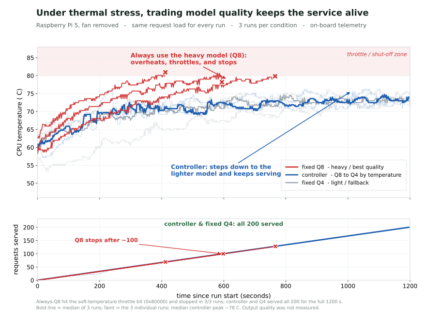

# M3 Thermal-continuity protocol and replicated result

> **What this is:** an experiment to test whether graceful degradation
> actually pays off: under a thermal stress that fixed Q8 cannot sustain, can the
> controller step down to Q4, avoid throttle / safety-stop, and keep serving the
> same open-loop demand? **Who it's for:** anyone judging whether the controller
> is worth its cost. **Status:** fan-off N=3 completed on 2026-06-21.

## Why this experiment

The fan-on N=5 evaluation never thermally stressed the Pi: nothing throttled, even
fixed Q8 (peak 65.3 C). So it showed the switching mechanism and its cost, not the
payoff. This protocol creates a controlled thermal stress and asks one question:

> Under a load that drives fixed Q8 toward throttling or a safety stop, does the
> controller — by stepping down to Q4 — avoid throttle / safety-stop and keep
> serving the same open-loop demand?

Primary thing it can show, directly measurable:

- **Continuity under thermal pressure.** If fixed Q8 reaches throttle or the
  safety stop, the controller keeps serving the same demand without either.

Secondary observation:

- **Temperature ceiling behavior.** The controller's configured ceiling is
  treated as a thermal-stress control point and a margin before throttling. It is
  not treated as a proven Raspberry Pi 5 wear threshold.

## What it will not show

- **Output quality.** Q4's answers may be worse; that is the separate
  quality-sensitive axis, not measured here.
- **Hardware wear or lifespan.** Raspberry Pi documentation gives throttling
  thresholds and an operating-temperature range, but not a device-specific
  lifespan-vs-temperature curve. This protocol therefore does not claim reduced
  wear or longer lifespan.
- **Energy efficiency.** Power is not required for the primary M3 claim. It can
  be logged as auxiliary context, but the acceptance condition is thermal
  continuity, not J/token or watts.
- Anything beyond this device, prompt, cooling condition, and ceiling.

## N=3 result (2026-06-21)

This run used the active fan disconnected and the heatsink still attached.
Airflow around the board was blocked after an earlier pilot appeared sensitive
to ambient airflow. PMIC power was logged as auxiliary context, but power is not
part of the M3 pass/fail result. Raw CSVs and logs stay under ignored `data/`
paths.

Before the comparison, a Q4 smoke run checked that the fixed load was viable:
with `arrival_interval_sec = 6.0`, Q4 completed 600 s / 100 requests with
`get_throttled = 0x0`. A heavier 4 s arrival interval was rejected first because
Q4 itself reached 79.0 C, leaving no clean controller ceiling below the cap.

Fixed conditions for the accepted N=3 run:

- `arrival_interval_sec = 6.0`
- run window `1200 s`
- start gate `get_throttled = 0x0`; accepted run start temperatures ranged from
  55.4 to 58.7 C. The gate was adjusted during the run because the fan-off,
  wind-blocked idle band did not reliably return to the original lower window.
- safety stop `temp >= 82 C` or any `get_throttled` change
- controller ceiling `temp_up_c = 71.1 C`, `temp_down_c = 67.1 C`

| Arm | N | Completed requests median | Peak temp median (C) | Throttle seen | Safety stop | Full window |
| --- | ---: | ---: | ---: | :---: | :---: | :---: |
| `q8_fixed` | 3 | 100 | 81.2 | 3/3 (`0x80000`) | 3/3 | 0/3 |
| `controller` | 3 | 200 | 77.9 | 0/3 | 0/3 | 3/3 |
| `q4_fixed` | 3 | 200 | 79.0 | 0/3 | 0/3 | 3/3 |

Controller details, median across N=3: `q4_fraction = 0.781`,
`switch_to_q4 = 7`, and `switch_to_q8 = 6`.

`controller_002` is retained in the ignored data tree for audit, but excluded
from this table because external airflow likely cooled the chip mid-run. The
aggregate above uses `controller_002_rerun` instead.



Interpretation, kept deliberately narrow:

- This is a direct replicated payoff case: under the same fan-off open-loop
  demand, fixed Q8 hit the Raspberry Pi sticky soft-temperature throttle bit in
  3/3 runs, while the controller kept serving the full window in 3/3 runs.
- This run is not evidence of fan-off long-run stability, optimal thresholds,
  output quality, hardware-wear reduction, or energy efficiency.
- The controller peaked above its 71.1 C ceiling in all runs, so the next
  engineering question is more thermal margin (switch earlier or lower the
  ceiling), not fewer switches: with independent requests and both models resident,
  frequent return to Q8 is cheap and maximizes quality.

Evidence package on the Pi:

```text
data/m2/2026-06-21/m3_thermal_continuity_arrival6_windblocked_start49_51_pmic/
```

## Fixed conditions

- **Hardware:** Raspberry Pi 5 (4 GB). The **heatsink stays attached**; only the
  active fan is removed for the stress condition, so passive cooling remains and
  the temperature climb is slower and safer.
- **Models:** the same Qwen2.5-1.5B `Q8_0` and `Q4_K_M` GGUF used in M2.
- **Workload:** open-loop, fixed arrival rate (`--arrival-interval-sec`), same
  prompt, `temperature = 0`, `max_tokens = 64`. Open-loop keeps the demand equal
  across arms, so the thermal comparison is not confounded by a faster model doing
  more work.
- **Cooling:** `fan_off` (heatsink on). A heavier-load `fan_on` variant is a
  fallback if fan-off climbs too fast to control.
- **Ceiling:** set the controller `temp_up_c` to the target ceiling and
  `temp_down_c` a few degrees below. The ceiling must sit **above** Q4's fan-off
  equilibrium (see Step 0) so the controller can actually hold it.
- **Duration:** a fixed window (e.g. 1200 s) or until a safety stop, whichever
  comes first.
- **Start gate:** each run waits for a configured CPU-temperature gate and
  `get_throttled = 0x0` (the N=1 pilot used <= 60 C because fan-off idle with
  both servers resident did not reliably cool to 50 C).
  If a run changes `get_throttled`, the next arm must not start automatically:
  Raspberry Pi sticky bits can remain set until reboot.
- **Repetitions:** N=1 smoke first; if the effect appears, N=3.
- **Power logging:** optional. Do not make USB power-meter readings part of the
  pass/fail result unless the question changes to energy efficiency.

## Step 0: smoke run (find the operating point)

Before the comparison, run one short fan-off pilot to learn:

1. Q4's fan-off equilibrium temperature (sets the lowest usable ceiling).
2. An arrival rate that keeps the SoC busy without reaching the safety cap in
   seconds.

Pick the ceiling a few degrees above Q4's equilibrium, and clearly below the
throttle point.

## Arms

1. `fixed_q8` — expected to climb past the ceiling; record time-to-ceiling,
   time-to-throttle (if any), and whether it safety-stops.
2. `controller` — switches to Q4 near the ceiling; expected to plateau at or below
   it and serve the full window.
3. `fixed_q4` — reference: where Q4 alone settles fan-off.

Rotate arm order, and let the Pi cool to the configured start gate with
`get_throttled = 0x0` between runs.

## Safety rules (mandatory)

- Hard safety stop at `safety_temp_c` (<= 82 C) or on any `get_throttled` change.
- Record the exact `get_throttled` hex value. Low-voltage and thermal bits are
  different evidence; do not collapse them into a generic "thermal" failure.
- A safety stop on `fixed_q8` **is a valid result, not a failure** — record it and
  do not push further. If `get_throttled` is no longer `0x0`, reboot before any
  next arm.
- Keep the heatsink on. Do not run fan-off unattended.
- Minimize the number of fan-off runs; cool fully between them.

## Run commands

```bash
# fixed Q8 under fan-off stress
python -m thermal_guardian.m2 run \
  --config m2.local.json --mode q8_fixed \
  --output-dir data/m2/YYYY-MM-DD/m3_stress/q8_fixed_001 \
  --arrival-interval-sec <R> --duration-sec 1200 \
  --cooling fan_off --safety-temp-c 82 --prompt-id-prefix m3

# fixed Q4 reference
python -m thermal_guardian.m2 run \
  --config m2.local.json --mode q4_fixed \
  --output-dir data/m2/YYYY-MM-DD/m3_stress/q4_fixed_001 \
  --arrival-interval-sec <R> --duration-sec 1200 \
  --cooling fan_off --safety-temp-c 82 --prompt-id-prefix m3

# controller with the ceiling config (temp_up_c = ceiling)
python -m thermal_guardian.router --config config.m3.fan_off.local.json
python -m thermal_guardian.m2 run \
  --config m2.local.json --mode controller \
  --output-dir data/m2/YYYY-MM-DD/m3_stress/controller_001 \
  --arrival-interval-sec <R> --duration-sec 1200 \
  --cooling fan_off --safety-temp-c 82 --prompt-id-prefix m3
```

## Required metrics (per run)

`peak_temp_c`, `time_to_ceiling_sec`, `time_to_throttle_sec` (if any),
`seconds_above_ceiling`, `seconds_throttled`, `safety_stop` (bool),
`requests_completed`, `controller_survived_full_window` (bool), and `q4_fraction`
for the controller.

Optional context: USB meter or PMIC readings may be recorded, but they are not
needed to decide whether the controller preserved service continuity under
thermal pressure.

## What would count as the payoff

- `fixed_q8` reaches the ceiling / throttle / safety stop, while `controller` holds
  at or below the ceiling and serves the full window → graceful degradation
  demonstrated.
- `controller` only delays the crossing → honest partial result: it extends safe
  operating time but does not prevent the crossing under sustained fan-off.
- Nothing crosses the ceiling → the stress was too low; raise the arrival rate or
  reduce cooling.

Each of these is a reportable result.

## Completion criteria

- All three arms run from matched cool starts, N >= 1 (N=3 if the effect appears).
- Every run has telemetry, requests, and manifest logs (plus controller events),
  and its safety outcome recorded.
- A summary states the ceiling and arrival rate used, and separates measured facts
  from interpretation. The finding and its wording are written by the author.
